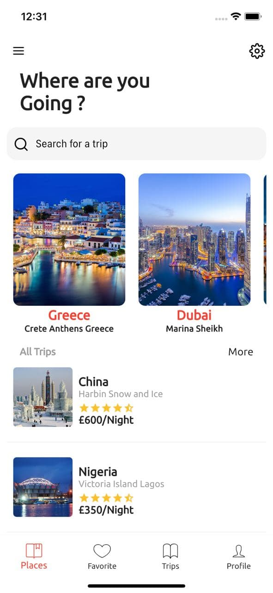
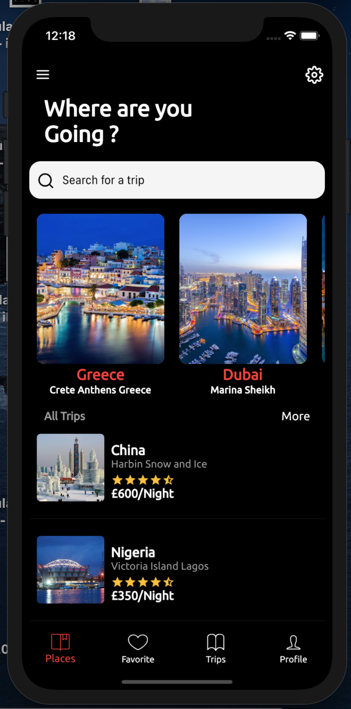
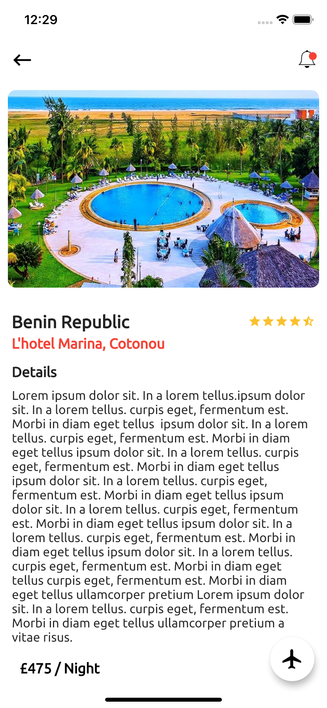
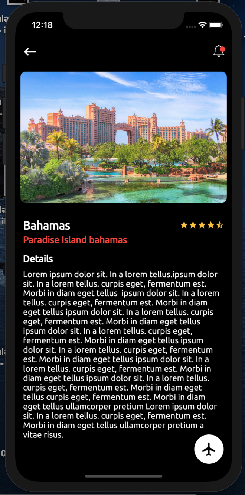

# Flutter Travel

A new Flutter project.

# 🔥🔥 Flutter Travel Ui 
Flutter representation of a Travel UI. 
**It only consists of 2 screens.**

Star⭐ the repo if you like what you see😉.

## ✨ Requirements
* Any Operating System (ie. MacOS X, Linux, Windows)
* Any IDE with Flutter SDK installed (ie. IntelliJ, Android Studio, VSCode etc)
* A little knowledge of Dart and Flutter
* A brain to think 🤓🤓

## 📸 ScreenShots

| Light| Dark|
|------|-------|
|||
|||

## 🌗 Toggle theme
To toggle the theme, In the `Theme` widget in `main.dart`.

`darkTheme` for dark and `lightTheme` for light.

## Getting Started

This project is a starting point for a Flutter application.

A few resources to get you started if this is your first Flutter project:

- [Lab: Write your first Flutter app](https://flutter.dev/docs/get-started/codelab)
- [Cookbook: Useful Flutter samples](https://flutter.dev/docs/cookbook)

For help getting started with Flutter, view our
[online documentation](https://flutter.dev/docs), which offers tutorials,
samples, guidance on mobile development, and a full API reference.
